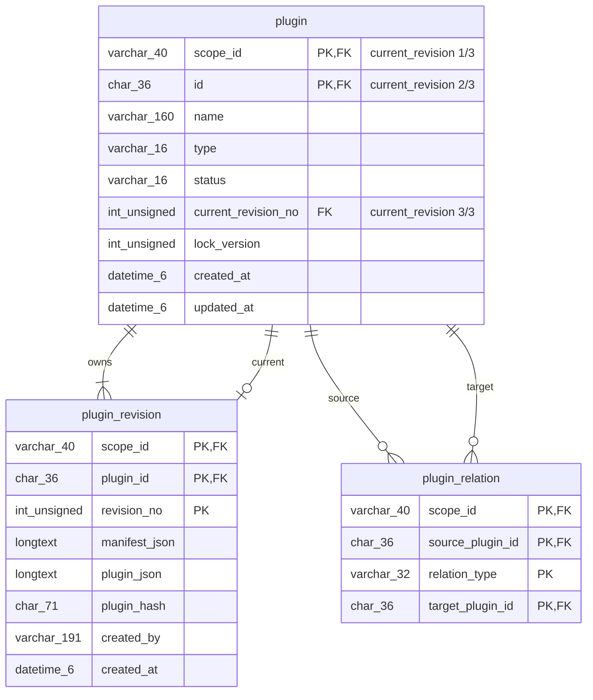

# Plugin Lib ER

API/Schema 使用 `plugin_id/plugin_name/plugin_type`；持久化到 `plugin` 表时分别对应
上下文明确的 `id/name/type`。Plugin 类型只允许 `expert`、`skill`、`expert_team`、
`connector`，状态只允许 `ACTIVE`、`ARCHIVED`。Relation 类型只允许
`expert_team_expert`、`expert_skill`、`expert_connector`。

## 约束

- `plugin` 主键：`(scope_id, id)`。
- `scope_id` 与 `id` 分别使用 ASCII 标识符和小写 UUID CHECK；所有子表通过复合外键继承
  同一 scope 与 Plugin 身份边界。
- `plugin_revision` 主键：`(scope_id, plugin_id, revision_no)`；外键指向
  `plugin(scope_id,id)`。
- 当前 Revision 是一个复合外键：
  `plugin(scope_id,id,current_revision_no) -> plugin_revision(scope_id,plugin_id,revision_no)`。
  `current_revision_no` 在建档事务中可暂时为 NULL，提交后的 Plugin 必须有当前 Revision。
- `plugin_relation` 主键：
  `(scope_id,source_plugin_id,relation_type,target_plugin_id)`；source/target 都通过
  包含 `scope_id` 的外键指向 `plugin`，数据库阻止跨 scope 关系。
- `revision_no` 由 Lib 在锁定 Plugin 行的事务内按当前值加一；不使用全表
  `AUTO_INCREMENT`。
- `lock_version` 覆盖内容、状态和关系三类当前态修改。
- Relation 是当前绑定，不属于 Revision；Restore 只恢复内容，不回滚关系。
- `description` 只保留在 Manifest 中，`plugin` 表不保存冗余投影，List 不支持描述搜索。
- `manifest_json/plugin_json` 是 `utf8mb4_bin LONGTEXT`，保存 Canonical JSON；Schema、
  语义校验与 `plugin_hash` 由 Lib 负责，不让 MySQL JSON 数值解析器缩窄公共契约。
- `created_by` 使用 `VARCHAR(191) ASCII BIN`，CHECK 与 Service 一致地只允许非空
  ASCII 标识符；191 是当前上限，主体格式和是否进一步收窄仍待多宿主确认。
- 无 `plugin_file` 表。Attachment 的物理位置由宿主 Content Store 根据
  `scope_id + content_hash` 解析。
